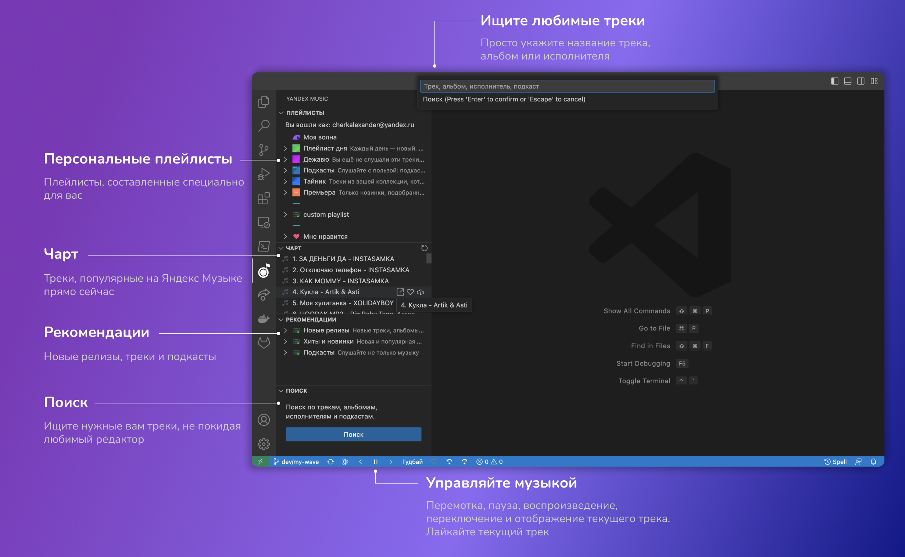

# [Yandex Music Extension](https://marketplace.visualstudio.com/items?itemName=acherkashin.yandex-music-extension)

<p align="center">
  
</p>

Extension allows you enjoy listening to YandexMusic right in your favorite code editor.
All operation systems are supported 🎉🎉🎉.



## Requirements

To use this extension you should have Yandex Music account.

## Extension Settings

This extension contributes the following settings:

- `yandexMusic.rewindTime` - Rewind time (optional, by default is 15s)
- `yandexMusic.showElectronApp` - shows electron app, which is used for playing audio (for debug purpose, by default is `false`)

```json
{
    "yandexMusic.rewindTime": 15,
    "yandexMusic.showElectronApp": false,
}
```

### Remote Development using SSH

When working on a remote machine via SSH, the extension attempts to download and run Electron on the remote machine by default. This is not the correct behavior. We need to instruct Visual Studio Code that the extension should run locally. This can be achieved by using the [remote.extensionKind](https://code.visualstudio.com/docs/remote/ssh#_advanced-forcing-an-extension-to-run-locally-remotely) setting as explained in the VS Code documentation.

```json
{
    "remote.extensionKind": {
        "acherkashin.yandex-music-extension": [ "ui" ]
    },
}
```

## Keyboard Shortcuts

- `Shift + Alt + P` - Play/pause track
- `Shift + Alt + N` - Play next track
- `Shift + Alt + B` - Play previous track
- `Shift + Alt + Y`, `Shift + Alt + M` - Open Yandex Music extension bar

## Contributing

You can open an issue on a GitHub page or contact me at cherkalexander@gmail.com with any additional questions or feedback.

## Support

- You can ask any questions about Yandex Music Api in [Telegram Chat](https://t.me/yandex_music_api)
- You can subscribe to [the author's telegram channel](https://t.me/cherkashindev) to support and motivate the author.

## Running locally

1. Ensure you have locally installed `nodejs` and `npm`.
2. Ensure you have locally installed `yarn` as it is used as package manager for this project.
3. Run `yarn install` in your terminal;
4. Open Visual Studio Code and press `F5`.


## Thanks

Thanks to [MarshalX](https://github.com/MarshalX/), [his project](https://github.com/MarshalX/yandex-music-api) was used as a foundation for [yandex-music-extension](https://github.com/acherkashin/yandex-music-extension) and [yandex-music-open-api](https://github.com/acherkashin/yandex-music-open-api).

